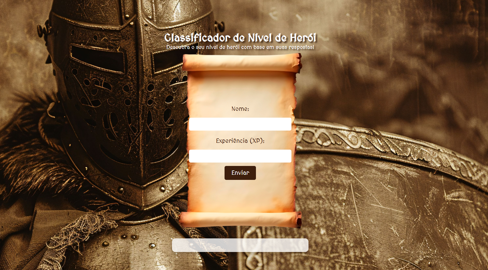

# Classificador de Nível de Herói

Este projeto é uma aplicação web simples que classifica o nível de um herói com base na experiência (XP) informada pelo usuário. O objetivo é demonstrar conceitos básicos de HTML, CSS e JavaScript, além de proporcionar uma interface temática medieval e interativa.

## Como funciona

O usuário deve preencher o nome do herói e a quantidade de experiência (XP) no formulário apresentado na página. Ao enviar, o sistema calcula e exibe a classificação do herói de acordo com a tabela de níveis:

- **Ferro**: menos de 1000 XP
- **Bronze**: 1001 a 2000 XP
- **Prata**: 2001 a 5000 XP
- **Ouro**: 5001 a 7000 XP
- **Platina**: 7001 a 8000 XP
- **Ascendente**: 8001 a 9000 XP
- **Imortal**: 9001 a 10000 XP
- **Radiante**: acima de 10000 XP

## Tecnologias utilizadas
- HTML5
- CSS3 (com tema medieval e responsivo)
- JavaScript puro

## Visual do Projeto

## Visualizar Online

Você pode acessar o projeto diretamente pelo GitHub Pages:

[Visualizar no GitHub Pages](https://jcquadros.github.io/classificador-de-nivel-de-heroi/)

## Como executar

1. Clone este repositório ou baixe os arquivos.
2. Abra o arquivo `index.html` em seu navegador.
3. Preencha o formulário e descubra a classificação do seu herói!

---

Projeto desenvolvido para fins educacionais na DIO.
